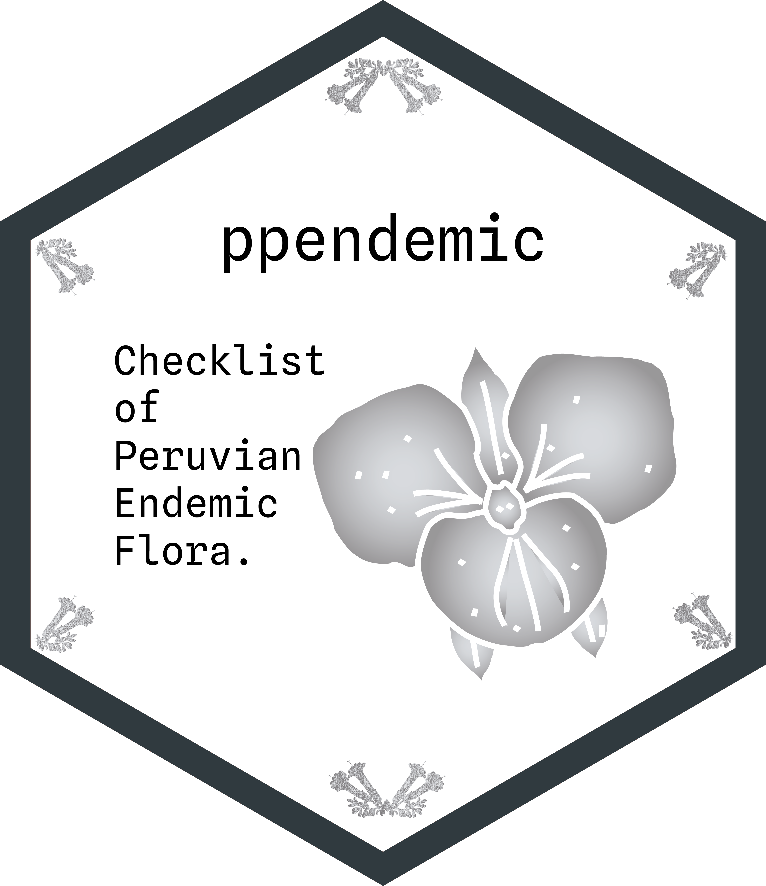

<!-- README.md is generated from README.Rmd. Please edit that file -->


```{r, include = FALSE}
knitr::opts_chunk$set(
  collapse = TRUE,
  comment = "#>",
  fig.path = "man/figures/README-",
  out.width = "100%"
)
library(tidyverse)
library(ppendemic)
```

# ppendemic <a href='https://github.com/PaulESantos/ppendemic'></a>

<!-- badges: start -->
[](https://lifecycle.r-lib.org/articles/stages.html)
[](https://CRAN.R-project.org/package=ppendemic)
[](https://cran.r-project.org/package=ppendemic)
[](https://cran.r-project.org/package=ppendemic)
[](https://app.codecov.io/gh/PaulESantos/ppendemic?branch=main)
[](https://zenodo.org/badge/latestdoi/336340798)
[](https://github.com/PaulESantos/ppendemic/actions/workflows/R-CMD-check.yaml)
<!-- badges: end -->

## Overview

This package offers convenient access to a new and extensive database containing a list of `r nrow(ppendemic::ppendemic_tab14)` endemic plant species found in Peru. This comprehensive collection provides detailed botanical information, including accepted names, family, genus, species, infraspecific taxonomy, authorship, publication details, and temporal information including both actual and nominal publication years for each species.

The construction of the `ppendemic` package is built upon valuable data sourced from the renowned **World Checklist of Vascular Plants (WCVP)** database. The WCVP is an international collaborative programme initiated in 1988 by Rafaël Govaerts that provides high-quality expert-reviewed taxonomic data on all vascular plants. As a highly authoritative resource updated daily, WCVP offers comprehensive information on plant taxonomy and occurrence worldwide, serving as the taxonomic backbone for World Flora Online (WFO) and being incorporated into the Catalogue of Life Checklist via GBIF. Leveraging this data, the ppendemic package aims to present an up-to-date and novel compilation of Peru's endemic plant species, tailored to the diverse ecosystems of the region.

By incorporating meticulously curated data from WCVP following the International Code of Nomenclature for algae, fungi, and plants (ICN), this package offers users a reliable and accurate resource to explore, analyze, and gain deeper insights into the rich diversity of Peru's endemic flora. The latest version (V-14, dated 28-05-2025) includes enhanced temporal bibliographic information with sophisticated year extraction capabilities, distinguishing between actual and nominal publication years for improved citation accuracy.

Representing a significant advancement in our understanding of Peru's endemic plant species, the ppendemic package update the previously known list of 5,507 species presented in the Red Book of Endemic Plants of Peru, bringing the total to an impressive `r nrow(ppendemic::ppendemic_tab14)` species. This substantial increase in documented endemic species is a testament to the continuous integration of updated taxonomic data and the commitment to presenting the most current information available. With this expanded and current database, researchers, conservationists, and nature enthusiasts alike can now delve into a more comprehensive and accurate account of Peru's unique and diverse plant biodiversity.

The database spans a total of `r length(unique(ppendemic::ppendemic_tab14$family))` families, with particular richness observed in the `r names(rev(sort(table(ppendemic::ppendemic_tab14$family))))[1:10]` families, all of which boast the highest number of endemic species in Peru. The enhanced dataset now includes `r sum(ppendemic::ppendemic_tab14$has_different_years, na.rm = TRUE)` records where actual and nominal publication years differ, providing valuable insights into historical botanical publishing practices.


```{r echo=FALSE, message=FALSE}
library(tidyverse)
ppendemic::ppendemic_tab14 |> 
  group_by(family) |> 
  summarise(n_especies = n_distinct(taxon_name)) |> 
  arrange(desc(n_especies)) |> 
  top_n(10) |> 
  ggplot(aes(fct_reorder(family, n_especies, .desc = TRUE),
             n_especies)) +
  geom_col() +
  labs(x = "Families",
       y = "Number of species",
       title = "Top 10 Families with Most Endemic Species in Peru",
       subtitle = paste("Based on", nrow(ppendemic::ppendemic_tab14), "endemic species records (Version V-14)")) +
  scale_x_discrete(guide = guide_axis(n.dodge = 2)) +
  theme_bw() +
  theme(plot.title = element_text(hjust = 0.5),
        plot.subtitle = element_text(hjust = 0.5))
```

## Installation

You can install the `ppendemic` package from CRAN using:

```r
install.packages("ppendemic")
# or
pak::pak("ppendemic")
```

Also you can install the `ppendemic` package from GitHub using the following command:

```r
pak::pak("PaulESantos/ppendemic")
```


## Getting Started

After installing the `ppendemic` package, you can load it into your R session using:

```{r}
library(ppendemic)

```

- Use `is_ppendemic()` to check if taxa are endemic

```{r}
splist <- c("Aa aurantiaca", 
             "Aa aurantiaaia",
             "Werneria nubigena", 
             "Dasyphyllum brasiliense var. barnadesioides",
             "Miconia firma",
             "Festuca densiflora")
is_ppendemic(splist)

```

- The `is_ppendemic()` function is designed to work seamlessly with tibbles, allowing users to easily analyze and determine the endemic status of species within a tabular format.

```{r}

tibble::tibble(splist = splist) |> 
  dplyr::mutate(endemic = is_ppendemic(splist))

```


## Citation

To cite the `ppendemic` package, please use:

```{r}
citation("ppendemic")
```

