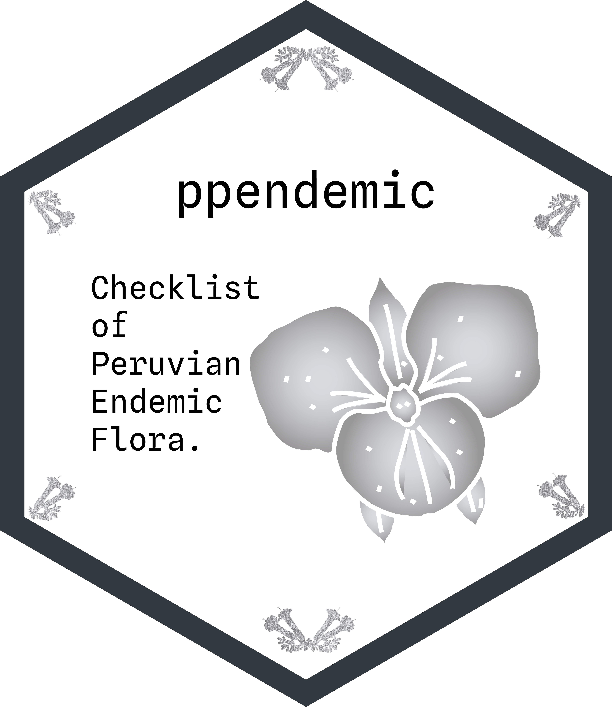

<!-- README.md is generated from README.Rmd. Please edit that file -->


```{r, include = FALSE}
knitr::opts_chunk$set(
  collapse = TRUE,
  comment = "#>",
  fig.path = "man/figures/README-",
  out.width = "100%"
)
library(tidyverse)
```

# ppendemic <a href='https://github.com/PaulESantos/ppendemic'></a>

<!-- badges: start -->
[](https://lifecycle.r-lib.org/articles/stages.html)
[](https://CRAN.R-project.org/package=ppendemic)
[](https://cran.r-project.org/package=ppendemic)
[](https://cran.r-project.org/package=ppendemic)
[](https://app.codecov.io/gh/PaulESantos/ppendemic?branch=main)
[](https://zenodo.org/badge/latestdoi/336340798)
[](https://github.com/PaulESantos/ppendemic/actions/workflows/R-CMD-check.yaml)
<!-- badges: end -->

## Overview

This package offers convenient access to a database containing `r nrow(ppendemic::ppendemic_tab16)` accepted endemic plant taxonomic records from Peru. The records include taxa at species and infraspecific ranks, together with accepted names, family, genus, specific epithet, infraspecific taxonomy, authorship, publication details, and actual and nominal publication years.

The construction of the `ppendemic` package is built upon valuable data sourced from the renowned **World Checklist of Vascular Plants (WCVP)** database. The WCVP is an international collaborative programme initiated in 1988 by Rafaël Govaerts that provides high-quality expert-reviewed taxonomic data on all vascular plants. As a highly authoritative resource updated daily, WCVP offers comprehensive information on plant taxonomy and occurrence worldwide, serving as the taxonomic backbone for World Flora Online (WFO) and being incorporated into the Catalogue of Life Checklist via GBIF. Leveraging this data, the ppendemic package aims to present an up-to-date and novel compilation of Peru's endemic plant species, tailored to the diverse ecosystems of the region.

By incorporating meticulously curated data from WCVP following the International Code of Nomenclature for algae, fungi, and plants (ICN), this package offers users a reliable and accurate resource to explore, analyze, and gain deeper insights into the rich diversity of Peru's endemic flora. The latest version (V-16, dated 04-06-2026) includes enhanced temporal bibliographic information with sophisticated year extraction capabilities, distinguishing between actual and nominal publication years for improved citation accuracy.

The current version expands the previously known list of 5,507 species presented in the Red Book of Endemic Plants of Peru to `r nrow(ppendemic::ppendemic_tab16)` accepted taxonomic records. Because the database includes infraspecific taxa, this row count must not be interpreted as the number of distinct species.

The database spans `r length(unique(ppendemic::ppendemic_tab16$family))` families. The families with the greatest numbers of endemic taxonomic records are `r names(rev(sort(table(ppendemic::ppendemic_tab16$family))))[1:10]`. The enhanced dataset also includes `r sum(ppendemic::ppendemic_tab16$has_different_years, na.rm = TRUE)` records where actual and nominal publication years differ.


```{r echo=FALSE, message=FALSE}
library(tidyverse)
ppendemic::ppendemic_tab16 |> 
  group_by(family) |> 
  summarise(n_taxa = n_distinct(taxon_name)) |>
  arrange(desc(n_taxa)) |>
  top_n(10) |> 
  ggplot(aes(fct_reorder(family, n_taxa, .desc = TRUE),
             n_taxa)) +
  geom_col() +
  labs(x = "Families",
       y = "Number of taxonomic records",
       title = "Top 10 Families with Most Endemic Taxonomic Records in Peru",
       subtitle = paste("Based on", nrow(ppendemic::ppendemic_tab16), "accepted endemic taxonomic records (Version V-16)")) +
  scale_x_discrete(guide = guide_axis(n.dodge = 2)) +
  theme_bw() +
  theme(plot.title = element_text(hjust = 0.5),
        plot.subtitle = element_text(hjust = 0.5))
```

## Installation

You can install the `ppendemic` package from CRAN using:

```r
install.packages("ppendemic")
# or
pak::pak("ppendemic")
```

Also you can install the `ppendemic` package from GitHub using the following command:

```r
pak::pak("PaulESantos/ppendemic")
```


## Getting Started

After installing the `ppendemic` package, you can load it into your R session using:

```{r}
library(ppendemic)

```

- Use `is_ppendemic()` to check if taxa are endemic

```{r}
splist <- c("Aa aurantiaca", 
             "Aa aurantiaaia",
             "Werneria nubigena", 
             "Dasyphyllum brasiliense var. barnadesioides",
             "Miconia firma",
             "Festuca densiflora")
is_ppendemic(splist)

```

- The `is_ppendemic()` function is designed to work seamlessly with tibbles, allowing users to easily analyze and determine the endemic status of species within a tabular format.

```{r}

tibble::tibble(splist = splist) |> 
  dplyr::mutate(endemic = is_ppendemic(splist))

```


## Citation

To cite the `ppendemic` package, please use:

```{r}
citation("ppendemic")
```
