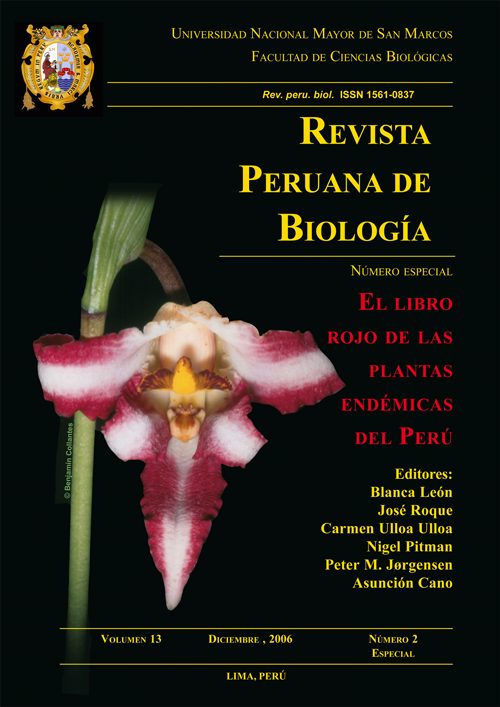

<!-- README.md is generated from README.Rmd. Please edit that file -->

# ppendemic <a href='https://github.com/PaulESantos/ppendemic'></a>

<!-- badges: start -->

[](https://lifecycle.r-lib.org/articles/stages.html)
[](https://CRAN.R-project.org/package=ppendemic)
[](https://cran.r-project.org/package=ppendemic)
[](https://cran.r-project.org/package=ppendemic)
[](https://cran.r-project.org/package=ppendemic)

<!-- badges: end -->
<blockquote align="center">
…El libro rojo de las plantas endémicas del Perú constituye, en este
aspecto una herramienta fundamental para determinar las medidas
necesarias para la conservación de la flora peruana. - Kember Mejía
Carhuanca
</blockquote>

The flora of Peru is one of the richest in the New World, with over
14,000 species, and 5,508 taxa are treated as endemic. This represents a
significant proportion of the South American flora, highlighting the
importance of Peru in the conservation of New World flora.

The pandemic package takes the data from the **The red book of endemic
plants of Peru** and update the taxonomic information for all species
included using the [Taxonomic Name Resolution
Service](https://tnrs.biendata.org/) api.

The goal of ppendemic is to provide access to the endemic plant species
data in Peru.

## Installation:

You can install:

the most recent officially-released version from
[CRAN](https://CRAN.R-project.org) with:

``` r
install.packages("ppendemic")
```

the latest development version from [GitHub](https://github.com/) with:

``` r
# install.packages("remotes")
remotes::install_github("PaulESantos/ppendemic")
```

## About the data

Data were published and made available by the [Revista Peruana de
Biología](https://revistasinvestigacion.unmsm.edu.pe/index.php/rpb/index)
in volume 13 and number 2 [available
here](https://revistasinvestigacion.unmsm.edu.pe/index.php/rpb/issue/view/153),
on 2006. Edited by Blanca León et al.

## Citation

To cite the ppendemic package, please use:

``` r
citation("ppendemic")
#> 
#> To cite ppendemic in publications use:
#> 
#>   Santos-Andrade PE, Vilca-Bustamante LL (2021). ppendemic: The red
#>   book of endemic plants of Peru data. R package version 0.1.4.
#> 
#> A BibTeX entry for LaTeX users is
#> 
#>   @Manual{,
#>     title = {ppendemic: The red book of endemic plants of Peru data},
#>     author = {Paul Efren Santos Andrade and Lucely L. Vilca Bustamante},
#>     year = {2021},
#>     note = {R package version 0.1.4},
#>     url = {https://github.com/PaulESantos/ppendemic},
#>   }
```

## References

**Data originally published in:**

-   León, B., Pitman, N., & Roque Gamarra, J. E. (2006). Introducción a
    las plantas endémicas del Perú. Revista Peruana de Biologia, 13(2),
    9s-22s.
    [Here](https://revistasinvestigacion.unmsm.edu.pe/index.php/rpb/issue/view/153)
