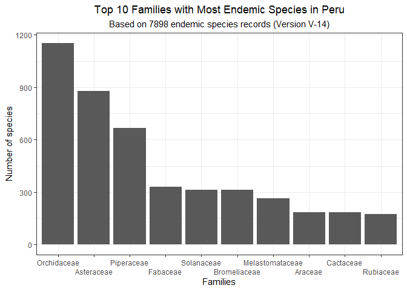

<!-- README.md is generated from README.Rmd. Please edit that file -->

# ppendemic

<!-- badges: start -->

[](https://lifecycle.r-lib.org/articles/stages.html)
[](https://CRAN.R-project.org/package=ppendemic)
[](https://cran.r-project.org/package=ppendemic)
[](https://cran.r-project.org/package=ppendemic)
[](https://app.codecov.io/gh/PaulESantos/ppendemic?branch=main)
<!-- badges: end -->

## Overview

`ppendemic` is an R package that offers convenient access to a new and
extensive database containing a list of 7,249 endemic plant species
found in Peru. This comprehensive collection provides detailed botanical
information, including accepted names, family, authorship, publication
details, and the place and date of first publication for each species.

The construction of the ppendemic package is built upon valuable data
sourced from the renowned `World Checklist of Vascular Plants (WCVP)`
database. As a highly authoritative resource, WCVP offers comprehensive
information on plant taxonomy and occurrence worldwide. Leveraging this
data, the `ppendemic` package aims to present an up-to-date and novel
compilation of Peru’s endemic plant species, tailored to the diverse
ecosystems of the region. By incorporating meticulously curated data
from WCVP, this package offers users a reliable and accurate resource to
explore, analyze, and gain deeper insights into the rich diversity of
Peru’s endemic flora.

Representing a significant advancement in our understanding of Peru’s
endemic plant species, the `ppendemic` package surpasses the previously
known list of 5,507 species presented in the Red Book of Endemic Plants
of Peru, bringing the total to an impressive 7,249 species. This
substantial increase in documented endemic species is a testament to the
integration of data and the commitment to presenting the most up-to-date
information. With this expanded and current database, researchers,
conservationists, and nature enthusiasts alike can now delve into a more
comprehensive and accurate account of Peru’s unique and diverse plant
biodiversity. The `ppendemic` package stands as a valuable resource for
anyone interested in the study, conservation, and appreciation of Peru’s
endemic plant life.

The database spans a total of 169 families, with particular richness
observed in the Orchidaceae, Asteraceae, Piperaceae, Solanaceae,
Fabaceae, Bromeliaceae, Melastomataceae, Araceae, Rubiaceae, and
Gentianaceae families, all of which boast the highest number of endemic
species in Peru.



## Installation

You can install the `ppendemic` package from GitHub using the following
command:

``` r
pak::pak("PaulESantos/ppendemic")
```

## Getting Started

After installing the `ppendemic` package, you can load it into your R
session using:

``` r
library(ppendemic)
```

- Use `is_ppendemic()` to check if taxa are endemic

``` r
splist <- c("Aa aurantiaca", "Aa aurantiaaia",
            "Werneria nubigena", "Piper politum var. politum",
            "Miconia firma")
is_ppendemic(splist)
#> [1] "Aa aurantiaca is endemic"                 
#> [2] "Aa aurantiaca is endemic - fuzzy matching"
#> [3] "not endemic"                              
#> [4] "not endemic"                              
#> [5] "Miconia firma is endemic"
```

- The `is_ppendemic()` function is designed to work seamlessly with
  tibbles, allowing users to easily analyze and determine the endemism
  status of species within a tabular format.

``` r

tibble::tibble(splist = splist) |> 
  dplyr::mutate(endemic = is_ppendemic(splist))
#> # A tibble: 5 × 2
#>   splist                     endemic                                  
#>   <chr>                      <chr>                                    
#> 1 Aa aurantiaca              Aa aurantiaca is endemic                 
#> 2 Aa aurantiaaia             Aa aurantiaca is endemic - fuzzy matching
#> 3 Werneria nubigena          not endemic                              
#> 4 Piper politum var. politum not endemic                              
#> 5 Miconia firma              Miconia firma is endemic
```

- Utilize the `get_ppendemic_data()` function to retrieve comprehensive
  taxonomic information.

``` r

get_ppendemic_data(splist = splist)
#>               name_submitted accepted_name accepted_family accepted_name_author
#> 1              Aa aurantiaca Aa aurantiaca     Orchidaceae           D.Trujillo
#> 2             Aa aurantiaaia Aa aurantiaca     Orchidaceae           D.Trujillo
#> 3          Werneria nubigena          nill            nill                 nill
#> 4 Piper politum var. politum          nill            nill                 nill
#> 5              Miconia firma Miconia firma Melastomataceae           J.F.Macbr.
#>   publication_author                   place_of_publication volume_and_page
#> 1               <NA>                          Lankesteriana           11: 3
#> 2               <NA>                          Lankesteriana           11: 3
#> 3               nill                                   nill            nill
#> 4               nill                                   nill            nill
#> 5               <NA> Publ. Field Mus. Nat. Hist., Bot. Ser.      13(4): 411
#>   first_published dist
#> 1          (2011)    0
#> 2          (2011)    2
#> 3            nill nill
#> 4            nill nill
#> 5          (1941)    0
```

## Citation

To cite the `ppendemic` package, please use:

``` r
citation("ppendemic")
#> To cite ppendemic in publications use:
#> 
#>   Santos-Andrade PE, Vilca-Bustamante LL (2023). ppendemic: A glimpse
#>   at the diversity of Peru's endemic plants.
#> 
#> A BibTeX entry for LaTeX users is
#> 
#>   @Manual{,
#>     title = {ppendemic: A glimpse at the diversity of Peru's endemic plants},
#>     author = {Paul Efren Santos Andrade and Lucely L. Vilca Bustamante},
#>     year = {2023},
#>     note = {R package version 0.1.6},
#>     doi = {10.5281/zenodo.5106619},
#>     url = {https://github.com/PaulESantos/ppendemic},
#>   }
```
