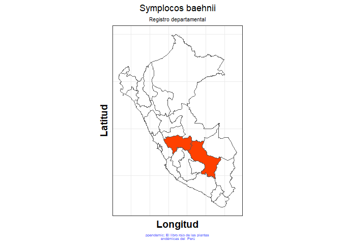

<!-- README.md is generated from README.Rmd. Please edit that file -->

# ppendemic <a href='https://github.com/PaulESantos/ppendemic'></a>

<!-- badges: start -->

[](https://lifecycle.r-lib.org/articles/stages.html)
[](https://CRAN.R-project.org/package=ppendemic)
[](https://travis-ci.com/PaulESantos/ppendemic)
<!-- badges: end -->

<blockquote align="center">
…El libro rojo de las plantas endémicas del Perú constituye, en este
aspecto una herramienta fundamental para determinar las medidas
necesarias para la conservación de la flora peruana. - Kember Mejía
Carhuanca
</blockquote>

The goal of ppendemic is to provide access to **The red book of endemic
plants of Peru** data.

## Installation:

You can install:

the most recent officially-released version from
[CRAN](https://CRAN.R-project.org) with:

``` r
install.packages("ppendemic")
```

the latest development version from [GitHub](https://github.com/) with:

``` r
# install.packages("remotes")
remotes::install_github("PaulESantos/ppendemic")
```

## About the data

Data were published and made available by the [Revista Peruana de
Biología](https://revistasinvestigacion.unmsm.edu.pe/index.php/rpb/index)
in volume 13 and number 2 [available
here](https://revistasinvestigacion.unmsm.edu.pe/index.php/rpb/issue/view/153),
on 2006. Edited by Blanca León et al.

## Examples:

`pep_check`, the basic function of `ppendemic`:

``` r
library(tidyverse)
library(ppendemic)
```

The function can be executed on a `vector` with the names of the species
to be verified.

``` r
spp <-  c("Clethra cuneata", "Miconia setulosa", "Weinmannia fagaroides", "Symplocos quitensis", "Miconia alpina", "Persea ruizii", "Myrsine andina", "Symplocos baehnii", "Polylepis pauta")

pep_check(spp)
#> [1] "not endemic" "not endemic" "not endemic" "not endemic" "endemic"    
#> [6] "not endemic" "not endemic" "endemic"     "not endemic"
```

Or in a tibble variable:

``` r
df <- tibble::tibble(sppe = c("Clethra cuneata", "Miconia setulosa",
                          "Weinmannia fagaroides", "Symplocos quitensis",
                          "Miconia alpina", "Persea ruizii",
                          "Myrsine andina", "Symplocos baehnii",
                          "Polylepis pauta"))

df
#> # A tibble: 9 x 1
#>   sppe                 
#>   <chr>                
#> 1 Clethra cuneata      
#> 2 Miconia setulosa     
#> 3 Weinmannia fagaroides
#> 4 Symplocos quitensis  
#> 5 Miconia alpina       
#> 6 Persea ruizii        
#> 7 Myrsine andina       
#> 8 Symplocos baehnii    
#> 9 Polylepis pauta

df %>% 
  mutate(endemic = pep_check(sppe))
#> # A tibble: 9 x 2
#>   sppe                  endemic    
#>   <chr>                 <chr>      
#> 1 Clethra cuneata       not endemic
#> 2 Miconia setulosa      not endemic
#> 3 Weinmannia fagaroides not endemic
#> 4 Symplocos quitensis   not endemic
#> 5 Miconia alpina        endemic    
#> 6 Persea ruizii         not endemic
#> 7 Myrsine andina        not endemic
#> 8 Symplocos baehnii     endemic    
#> 9 Polylepis pauta       not endemic
```

You can check the region where the endemic species are registered with
`pep_regdep` function:

``` r
pep_regdep("Miconia alpina")
#> # A tibble: 1 x 2
#>   accepted_name  registro_dep                 
#>   <chr>          <chr>                        
#> 1 Miconia alpina Áncash-Apurímac-Cusco-Huánuco
```

and build a map with `pep_regdep_map()`:

``` r
pep_regdep_map("Miconia alpina")
```



## Citation

To cite the ppendemic package, please use:

``` r
citation("ppendemic")
#> 
#> To cite ppendemic in publications use:
#> 
#>   Santos-Andrade PE, Vilca-Bustamante LL (2021). ppendemic: The red
#>   book of endemic plants of Peru data. R package version 0.1.1.
#> 
#> A BibTeX entry for LaTeX users is
#> 
#>   @Manual{,
#>     title = {ppendemic: The red book of endemic plants of Peru data},
#>     author = {Paul Efren Santos Andrade and Lucely L. Vilca Bustamante},
#>     year = {2021},
#>     note = {R package version 0.1.1},
#>     url = {https://github.com/PaulESantos/ppendemic},
#>   }
```

## References

**Data originally published in:**

-   León, B., J. Roque, C. Ulloa Ulloa, N. C. A. Pitman, P. M. Jørgensen
    & A. Cano Echevarría. 2006 \[2007\]. El Libro Rojo de las Plantas
    Endémicas del Perú. Revista Peruana Biol. 13(núm. 2 especial):
    1s–971s.[Here](https://revistasinvestigacion.unmsm.edu.pe/index.php/rpb/issue/view/153)
