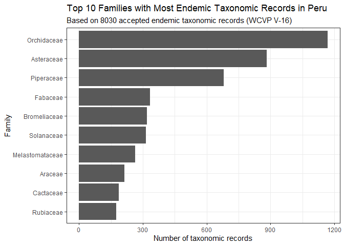

<!-- README.md is generated from README.Rmd. Please edit that file -->

# ppendemic <a href='https://github.com/PaulESantos/ppendemic'></a>

<!-- badges: start -->

[](https://lifecycle.r-lib.org/articles/stages.html)
[](https://CRAN.R-project.org/package=ppendemic)
[](https://cran.r-project.org/package=ppendemic)
[](https://cran.r-project.org/package=ppendemic)
[](https://app.codecov.io/gh/PaulESantos/ppendemic?branch=main)
[](https://zenodo.org/badge/latestdoi/336340798)
[](https://github.com/PaulESantos/ppendemic/actions/workflows/R-CMD-check.yaml)
<!-- badges: end -->

## Overview

`ppendemic` provides access to accepted endemic plant taxonomic records
from Peru. The current dataset, `ppendemic_tab16`, contains 8030 records
from WCVP V-16, including taxa at species and infraspecific ranks.

The package is useful for:

- exploring the taxonomic composition of Peru’s endemic flora;
- checking whether a submitted plant name is listed as endemic;
- comparing successive WCVP-derived versions of the endemic checklist;
  and
- inspecting bibliographic metadata, including actual and nominal
  publication years.

Because the database includes infraspecific taxa, the number of rows
must not be interpreted as the number of distinct species.

## What Is Included

The datasets include accepted endemic taxa with:

- accepted taxon name and taxonomic status;
- family, genus, specific epithet, infraspecific rank and infraspecific
  epithet;
- taxon authorship and publication metadata;
- actual and nominal publication years; and
- dataset version and extraction date.

The datasets do not include coordinates, departments, elevation,
habitat, threat categories, or fine-scale distribution records.
Geographic hotspot, conservation-priority, or range-size analyses
require joining `ppendemic` with external occurrence or conservation
datasets.

## Datasets

| dataset         | wcvp_version | extraction_date | records | families | genera |
|:----------------|:-------------|:----------------|--------:|---------:|-------:|
| ppendemic_tab14 | V-14         | 28-05-2025      |    7898 |      165 |   1116 |
| ppendemic_tab15 | V-15         | 06-01-2026      |    7892 |      165 |   1115 |
| ppendemic_tab16 | V-16         | 04-06-2026      |    8030 |      165 |   1121 |

`ppendemic_tab16` is the latest dataset and should be used by default
unless a reproducible analysis requires an older WCVP version.

The latest version expands the previously known list of 5,507 species
presented in the Red Book of Endemic Plants of Peru to 8030 accepted
taxonomic records. These records span 165 families; the most record-rich
families are Orchidaceae, Asteraceae, Piperaceae, Fabaceae,
Bromeliaceae, Solanaceae, Melastomataceae, Araceae, Cactaceae,
Rubiaceae.



## Installation

Install the CRAN release:

``` r
install.packages("ppendemic")
```

Or install the development version from GitHub:

``` r
pak::pak("PaulESantos/ppendemic")
```

## Getting Started

``` r
library(ppendemic)
#> ── Access Peruvian plant endemic data ─────────────────────── ppendemic 0.2.2 ──
```

Access the latest dataset directly:

``` r
data("ppendemic_tab16")
dplyr::glimpse(ppendemic_tab16)
#> Rows: 8,030
#> Columns: 18
#> $ taxon_name           <chr> "Varronia lippioides", "Varronia munda", "Varroni…
#> $ taxon_status         <chr> "Accepted", "Accepted", "Accepted", "Accepted", "…
#> $ family               <chr> "Boraginaceae", "Boraginaceae", "Boraginaceae", "…
#> $ Genus                <chr> "Varronia", "Varronia", "Varronia", "Adelonema", …
#> $ Species              <chr> "lippioides", "munda", "vargasii", "orientale", "…
#> $ infraspecific_rank   <chr> NA, NA, NA, NA, NA, NA, NA, NA, NA, NA, NA, NA, N…
#> $ infraspecies         <chr> NA, NA, NA, NA, NA, NA, NA, NA, NA, NA, NA, NA, N…
#> $ taxon_authors        <chr> "(I.M.Johnst.) J.S.Mill.", "(I.M.Johnst.) J.S.Mil…
#> $ primary_author       <chr> "J.S.Mill.", "J.S.Mill.", "J.S.Mill.", "Croat", "…
#> $ place_of_publication <chr> "Brittonia", "Brittonia", "Brittonia", "Syst. Bot…
#> $ volume_and_page      <chr> " 65: 342", " 65: 343", " 65: 343", " 41: 39", " …
#> $ first_published      <chr> "(2013)", "(2013)", "(2013)", "(2016)", "(2016)",…
#> $ year_actual          <dbl> 2013, 2013, 2013, 2016, 2016, 1991, 2016, 2015, 2…
#> $ year_nominal         <dbl> 2013, 2013, 2013, 2016, 2016, 1991, 2016, 2015, 2…
#> $ both_years           <chr> "2013", "2013", "2013", "2016", "2016", "1991", "…
#> $ has_different_years  <lgl> FALSE, FALSE, FALSE, FALSE, FALSE, FALSE, FALSE, …
#> $ version              <chr> "V-16", "V-16", "V-16", "V-16", "V-16", "V-16", "…
#> $ version_date         <chr> "04-06-2026", "04-06-2026", "04-06-2026", "04-06-…
```

Count records by family:

``` r
ppendemic_tab16 |>
  dplyr::count(family, sort = TRUE)
#> # A tibble: 165 × 2
#>    family              n
#>    <chr>           <int>
#>  1 Orchidaceae      1168
#>  2 Asteraceae        883
#>  3 Piperaceae        680
#>  4 Fabaceae          334
#>  5 Bromeliaceae      319
#>  6 Solanaceae        314
#>  7 Melastomataceae   263
#>  8 Araceae           214
#>  9 Cactaceae         188
#> 10 Rubiaceae         176
#> # ℹ 155 more rows
```

## Check Endemism

Use `is_ppendemic()` to check whether submitted names are listed as
endemic:

``` r
splist <- c(
  "Aa aurantiaca",
  "Aa aurantiaaia",
  "Werneria nubigena",
  "Dasyphyllum brasiliense var. barnadesioides",
  "Miconia firma",
  "Festuca densiflora"
)

is_ppendemic(splist)
#> [1] "Endemic"     "Endemic"     "Not endemic" "Endemic"     "Endemic"    
#> [6] "Endemic"
```

The matching engine uses exact and fuzzy matching. The `max_dist`
argument controls fuzzy tolerance:

``` r
is_ppendemic("Aa aurantiaaia", max_dist = 0)
#> [1] "Not endemic"
is_ppendemic("Aa aurantiaaia", max_dist = 2)
#> [1] "Endemic"
```

Indeterminate names such as `sp.` and `spp.` are treated as genus-level
records and are not classified as endemic taxa:

``` r
is_ppendemic(c("Piper sp.", "Piper spp."))
#> The species list (`splist`) should only include binomial names. The following
#> names were submitted at the genus level: "Piper sp." and "Piper spp."
#> [1] "Not endemic" "Not endemic"
```

`is_ppendemic()` can also be used inside tabular workflows:

``` r
tibble::tibble(splist = splist) |>
  dplyr::mutate(endemic = is_ppendemic(splist))
#> # A tibble: 6 × 2
#>   splist                                      endemic    
#>   <chr>                                       <chr>      
#> 1 Aa aurantiaca                               Endemic    
#> 2 Aa aurantiaaia                              Endemic    
#> 3 Werneria nubigena                           Not endemic
#> 4 Dasyphyllum brasiliense var. barnadesioides Endemic    
#> 5 Miconia firma                               Endemic    
#> 6 Festuca densiflora                          Endemic
```

For detailed matching diagnostics, use `matching_ppendemic()`:

``` r
matching_ppendemic(splist) |>
  dplyr::select(Orig.Name, Matched.Name, Endemic.Tag, matched)
#>                                     Orig.Name
#> 1                               Aa aurantiaca
#> 2                              Aa aurantiaaia
#> 3                           Werneria nubigena
#> 4 Dasyphyllum brasiliense var. barnadesioides
#> 5                               Miconia firma
#> 6                          Festuca densiflora
#>                                  Matched.Name Endemic.Tag matched
#> 1                               Aa aurantiaca     Endemic    TRUE
#> 2                               Aa aurantiaca     Endemic    TRUE
#> 3                                    Werneria Not endemic   FALSE
#> 4 Dasyphyllum brasiliense var. barnadesioides     Endemic    TRUE
#> 5                               Miconia firma     Endemic    TRUE
#> 6                          Festuca densiflora     Endemic    TRUE
```

## Compare Versions

The package includes a vignette for comparing inclusions, exclusions,
and possible nomenclatural replacements across dataset versions:

``` r
vignette("cambios-entre-versiones", package = "ppendemic")
```

## Citation

To cite `ppendemic`, use:

``` r
citation("ppendemic")
#> To cite ppendemic in publications use:
#> 
#>   Santos-Andrade PE, Vilca-Bustamante LL (2026). ppendemic: Accepted
#>   Endemic Plant Taxa from Peru. R package version 0.2.2. Current data
#>   release based on WCVP version 16, extracted 04 June 2026.
#>   https://paulesantos.github.io/ppendemic/. doi:10.5281/zenodo.5106619.
#> 
#> A BibTeX entry for LaTeX users is
#> 
#>   @Manual{,
#>     title = {ppendemic: Accepted Endemic Plant Taxa from Peru},
#>     author = {Paul E. {Santos Andrade} and Lucely L. {Vilca Bustamante}},
#>     year = {2026},
#>     note = {R package version 0.2.2. Current data release is based on WCVP version 16, extracted 04 June 2026.},
#>     doi = {10.5281/zenodo.5106619},
#>     url = {https://paulesantos.github.io/ppendemic/},
#>   }
```
