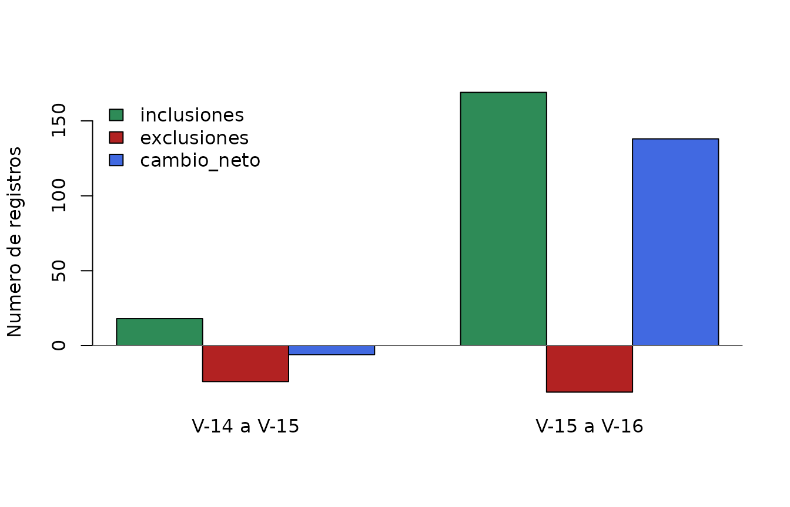

# Cambios entre versiones de la base de plantas endemicas del Peru

## Objetivo

Las tablas `ppendemic_tab14`, `ppendemic_tab15` y `ppendemic_tab16`
representan extracciones sucesivas de WCVP. Compararlas permite
identificar:

- nombres que permanecen entre versiones;
- posibles inclusiones y exclusiones;
- correcciones ortograficas o de terminacion;
- cambios de rango infraespecifico; y
- posibles transferencias entre generos.

Una inclusion o exclusion observada no implica necesariamente que una
especie haya sido descubierta o dejado de ser endemica. Tambien puede
reflejar cambios taxonomicos, nomenclaturales o de los criterios de
distribucion usados por WCVP. Por eso, esta viñeta distingue los cambios
observados de su posible interpretacion.

## Funciones para comparar versiones

La unidad de comparacion es `taxon_name`. Los nombres presentes solo en
la version nueva son inclusiones observadas y los presentes solo en la
version anterior son exclusiones observadas.

Para detectar posibles reemplazos se calcula una puntuacion conservadora
entre cada nombre retirado y cada nombre añadido. La puntuacion combina
similitud textual y coincidencias en epitetos, autoria, familia y año de
publicacion. Estos vinculos son candidatos para revision, no sinonimias
confirmadas.

``` r

candidate_replacements <- function(removed, added) {
  if (nrow(removed) == 0L || nrow(added) == 0L) {
    return(tibble::tibble())
  }

  same_val <- function(x, y) {
    !is.na(x) & !is.na(y) & x != "" & y != "" & x == y
  }

  name_sim <- function(x, y) {
    distance <- diag(adist(tolower(x), tolower(y)))
    lengths <- pmax(nchar(x), nchar(y))
    1 - distance / lengths
  }

  pairs <- dplyr::cross_join(
    removed %>% dplyr::rename_with(~ paste0(.x, "_old")),
    added %>% dplyr::rename_with(~ paste0(.x, "_new"))
  )

  candidates <- pairs %>%
    dplyr::mutate(
      similarity = name_sim(taxon_name_old, taxon_name_new),
      same_species = same_val(Species_old, Species_new),
      same_infraspecies = same_val(infraspecies_old, infraspecies_new),
      same_author = same_val(taxon_authors_old, taxon_authors_new),
      same_family = same_val(family_old, family_new),
      same_year = same_val(year_actual_old, year_actual_new),
      
      score = 0.40 * similarity +
        0.25 * same_species +
        0.10 * same_infraspecies +
        0.15 * same_author +
        0.05 * same_family +
        0.05 * same_year
    ) %>%
    dplyr::filter(score >= 0.50)

  if (nrow(candidates) == 0L) {
    return(tibble::tibble())
  }

  candidates %>%
    dplyr::mutate(
      interpretacion = dplyr::case_when(
        same_species & same_infraspecies & coalesce(infraspecific_rank_old != infraspecific_rank_new, FALSE) ~ "Posible cambio de rango",
        same_species & coalesce(Genus_old != Genus_new, FALSE) ~ "Posible transferencia de genero",
        similarity >= 0.85 & (same_author | same_year) ~ "Posible correccion ortografica",
        TRUE ~ "Posible reemplazo taxonomico"
      ),
      puntuacion = round(score, 3)
    ) %>%
    dplyr::select(
      exclusion_observada = taxon_name_old,
      inclusion_observada = taxon_name_new,
      familia = family_new,
      interpretacion,
      puntuacion
    ) %>%
    dplyr::arrange(dplyr::desc(puntuacion))
}

compare_versions <- function(old, new) {
  removed <- dplyr::anti_join(old, new, by = "taxon_name")
  added <- dplyr::anti_join(new, old, by = "taxon_name")
  candidates <- candidate_replacements(removed, added)

  linked_removed <- unique(candidates$exclusion_observada)
  linked_added <- unique(candidates$inclusion_observada)

  list(
    summary = tibble::tibble(
      version_anterior = unique(old$version),
      version_nueva = unique(new$version),
      registros_anteriores = nrow(old),
      registros_nuevos = nrow(new),
      inclusiones_observadas = nrow(added),
      exclusiones_observadas = nrow(removed),
      cambio_neto = registros_nuevos - registros_anteriores,
      posibles_reemplazos = nrow(candidates)
    ),
    candidates = candidates,
    probable_inclusions = added %>%
      dplyr::filter(!taxon_name %in% linked_added) %>%
      dplyr::select(taxon_name, family, year_actual),
    probable_exclusions = removed %>%
      dplyr::filter(!taxon_name %in% linked_removed) %>%
      dplyr::select(taxon_name, family, year_actual)
  )
}

comparison_14_15 <- compare_versions(ppendemic_tab14, ppendemic_tab15)
comparison_15_16 <- compare_versions(ppendemic_tab15, ppendemic_tab16)
```

## Magnitud de los cambios

``` r

change_summary <- dplyr::bind_rows(
  comparison_14_15$summary,
  comparison_15_16$summary
)

knitr::kable(
  change_summary,
  caption = "Cambios observados y posibles reemplazos entre versiones."
)
```

| version_anterior | version_nueva | registros_anteriores | registros_nuevos | inclusiones_observadas | exclusiones_observadas | cambio_neto | posibles_reemplazos |
|:---|:---|---:|---:|---:|---:|---:|---:|
| V-14 | V-15 | 7898 | 7892 | 18 | 24 | -6 | 8 |
| V-15 | V-16 | 7892 | 8030 | 169 | 31 | 138 | 14 |

Cambios observados y posibles reemplazos entre versiones. {.table}

El cambio neto debe interpretarse junto con las inclusiones y
exclusiones brutas. Por ejemplo, una correccion ortografica genera
simultaneamente una salida y una entrada aunque represente al mismo
taxon.

``` r

plot_values <- rbind(
  inclusiones = change_summary$inclusiones_observadas,
  exclusiones = -change_summary$exclusiones_observadas,
  cambio_neto = change_summary$cambio_neto
)

barplot(
  plot_values,
  beside = TRUE,
  names.arg = paste(
    change_summary$version_anterior,
    change_summary$version_nueva,
    sep = " a "
  ),
  col = c("#2E8B57", "#B22222", "#4169E1"),
  ylab = "Numero de registros",
  legend.text = rownames(plot_values),
  args.legend = list(x = "topleft", bty = "n")
)
abline(h = 0, col = "grey40")
```



## Posibles correcciones y cambios taxonomicos

Los siguientes pares no deben contarse automaticamente como nuevas
especies o perdidas de endemicidad. Comparten suficiente informacion
para considerarlos posibles reemplazos entre versiones.

``` r

knitr::kable(
  comparison_14_15$candidates,
  caption = "Posibles reemplazos entre V-14 y V-15."
)
```

| exclusion_observada | inclusion_observada | familia | interpretacion | puntuacion |
|:---|:---|:---|:---|---:|
| Lobivia backebergii subsp. wrightiana | Echinopsis backebergii subsp. wrightiana | Cactaceae | Posible transferencia de genero | 0.720 |
| Lobivia maximiliana subsp. westii | Echinopsis maximiliana subsp. westii | Cactaceae | Posible transferencia de genero | 0.711 |
| Pinguicula rosmariae | Pinguicula rosmarieae | Lentibulariaceae | Posible correccion ortografica | 0.631 |
| Gentianella waygecha | Gentianella wayqecha | Gentianaceae | Posible correccion ortografica | 0.630 |
| Lobivia hertrichiana | Echinopsis hertrichiana | Cactaceae | Posible transferencia de genero | 0.561 |
| Lobivia tegeleriana | Echinopsis tegeleriana | Cactaceae | Posible transferencia de genero | 0.555 |
| Soehrensia sandiensis | Echinopsis sandiensis | Cactaceae | Posible transferencia de genero | 0.548 |
| Lobivia pampana | Echinopsis pampana | Cactaceae | Posible transferencia de genero | 0.522 |

Posibles reemplazos entre V-14 y V-15. {.table}

``` r

knitr::kable(
  comparison_15_16$candidates,
  caption = "Posibles reemplazos entre V-15 y V-16."
)
```

| exclusion_observada | inclusion_observada | familia | interpretacion | puntuacion |
|:---|:---|:---|:---|---:|
| Peperomia nivalis var. nivalis | Peperomia nivalis f. nivalis | Piperaceae | Posible cambio de rango | 0.760 |
| Senecio danal | Senecio danai | Asteraceae | Posible correccion ortografica | 0.619 |
| Eudema chacasensis | Eudema chacasense | Brassicaceae | Posible correccion ortografica | 0.606 |
| Tovomita chachapoyasensis | Clusia chachapoyasensis | Clusiaceae | Posible transferencia de genero | 0.604 |
| Eudema cuscoensis | Eudema cuscoense | Brassicaceae | Posible correccion ortografica | 0.603 |
| Eudema peruviana | Eudema peruvianum | Brassicaceae | Posible correccion ortografica | 0.603 |
| Eudema limensis | Eudema limense | Brassicaceae | Posible correccion ortografica | 0.597 |
| Eudema incurva | Eudema incurvum | Brassicaceae | Posible correccion ortografica | 0.597 |
| Peperomia nivalis var. compacta | Peperomia nivalis f. nivalis | Piperaceae | Posible reemplazo taxonomico | 0.571 |
| Peperomia nivalis var. sanmarcensis | Peperomia nivalis f. nivalis | Piperaceae | Posible reemplazo taxonomico | 0.563 |
| Peperomia nivalis var. lepadiphylla | Peperomia nivalis f. nivalis | Piperaceae | Posible reemplazo taxonomico | 0.551 |
| Tessmanniacanthus chlamydocardioides | Justicia chlamydocardioides | Acanthaceae | Posible transferencia de genero | 0.544 |
| Cuatrecasanthus sandemanii | Critoniopsis sandemanii | Asteraceae | Posible transferencia de genero | 0.515 |
| Hibiscus chancoae | Sabdariffa chancoae | Malvaceae | Posible transferencia de genero | 0.511 |

Posibles reemplazos entre V-15 y V-16. {.table}

Entre los patrones detectables se encuentran:

- cambios de terminacion, como `Eudema chacasensis` a
  `Eudema chacasense`;
- correcciones ortograficas, como `Senecio danal` a `Senecio danai`;
- cambios de rango, como `Peperomia nivalis var. nivalis` a
  `Peperomia nivalis f. nivalis`; y
- posibles transferencias de genero, como especies de `Lobivia` que
  aparecen posteriormente bajo `Echinopsis`.

Estos casos requieren validacion contra sinonimos, identificadores
taxonomicos estables o la historia nomenclatural de WCVP.

## Posibles inclusiones

Despues de retirar los candidatos a reemplazo, los nombres restantes son
las inclusiones con mayor probabilidad de representar incorporaciones a
la lista. La version V-16 concentra numerosas inclusiones publicadas
recientemente.

``` r

inclusions_15_16 <- comparison_15_16$probable_inclusions

inclusion_families <- inclusions_15_16 %>%
  dplyr::count(family, name = "posibles_inclusiones") %>%
  dplyr::arrange(dplyr::desc(posibles_inclusiones)) %>%
  dplyr::slice_head(n = 15) %>%
  dplyr::rename(familia = family)

knitr::kable(
  inclusion_families,
  caption = "Familias con mas posibles inclusiones entre V-15 y V-16."
)
```

| familia        | posibles_inclusiones |
|:---------------|---------------------:|
| Acanthaceae    |                   28 |
| Araceae        |                   28 |
| Piperaceae     |                   22 |
| Orchidaceae    |                   17 |
| Passifloraceae |                    9 |
| Bromeliaceae   |                    6 |
| Asteraceae     |                    5 |
| Malvaceae      |                    5 |
| Gesneriaceae   |                    4 |
| Annonaceae     |                    2 |
| Crassulaceae   |                    2 |
| Lauraceae      |                    2 |
| Moraceae       |                    2 |
| Poaceae        |                    2 |
| Solanaceae     |                    2 |

Familias con mas posibles inclusiones entre V-15 y V-16. {.table}

``` r

recent_inclusions <- inclusions_15_16 %>%
  dplyr::filter(!is.na(year_actual), year_actual >= 2024) %>%
  dplyr::arrange(dplyr::desc(year_actual)) %>%
  dplyr::slice_head(n = 25)

knitr::kable(
  recent_inclusions,
  caption = "Ejemplos de posibles inclusiones publicadas desde 2024."
)
```

| taxon_name              | family           | year_actual |
|:------------------------|:-----------------|------------:|
| Anthurium aldavei       | Araceae          |        2025 |
| Aristolochia guillermoi | Aristolochiaceae |        2025 |
| Gynoxys yasgolgensis    | Asteraceae       |        2025 |
| Justicia huallagensis   | Acanthaceae      |        2025 |
| Justicia oxapampensis   | Acanthaceae      |        2025 |
| Anthurium castilloae    | Araceae          |        2025 |
| Justicia rojasiae       | Acanthaceae      |        2025 |
| Agarista eugeniifolia   | Ericaceae        |        2025 |
| Anthurium divisoriense  | Araceae          |        2025 |
| Aphelandra floribunda   | Acanthaceae      |        2025 |
| Ayapana sprucei         | Asteraceae       |        2025 |
| Justicia werffii        | Acanthaceae      |        2025 |
| Justicia schunkei       | Acanthaceae      |        2025 |
| Justicia spathuliformis | Acanthaceae      |        2025 |
| Justicia cajamarcensis  | Acanthaceae      |        2025 |
| Justicia lallanii       | Acanthaceae      |        2025 |
| Jungia alba             | Asteraceae       |        2025 |
| Justicia lactiflora     | Acanthaceae      |        2025 |
| Justicia baguensis      | Acanthaceae      |        2025 |
| Justicia saccata        | Acanthaceae      |        2025 |
| Nototriche chambii      | Malvaceae        |        2025 |
| Aniba taftii            | Lauraceae        |        2025 |
| Anthurium bongarense    | Araceae          |        2025 |
| Anthurium sandanielense | Araceae          |        2025 |
| Aphelandra calciferi    | Acanthaceae      |        2025 |

Ejemplos de posibles inclusiones publicadas desde 2024. {.table}

## Posibles exclusiones

Los nombres retirados que no tienen un reemplazo candidato son posibles
exclusiones. Una exclusion puede deberse a que el taxon dejo de
considerarse aceptado o exclusivamente peruano, pero esa causa no puede
determinarse solo con estas tablas.

``` r

exclusions_15_16 <- comparison_15_16$probable_exclusions

exclusion_families <- exclusions_15_16 %>%
  dplyr::count(family, name = "posibles_exclusiones") %>%
  dplyr::arrange(dplyr::desc(posibles_exclusiones)) %>%
  dplyr::rename(familia = family)

knitr::kable(
  exclusion_families,
  caption = "Familias de las posibles exclusiones entre V-15 y V-16."
)
```

| familia       | posibles_exclusiones |
|:--------------|---------------------:|
| Piperaceae    |                    6 |
| Apocynaceae   |                    3 |
| Orchidaceae   |                    2 |
| Acanthaceae   |                    1 |
| Aspleniaceae  |                    1 |
| Clusiaceae    |                    1 |
| Gentianaceae  |                    1 |
| Myristicaceae |                    1 |
| Rubiaceae     |                    1 |

Familias de las posibles exclusiones entre V-15 y V-16. {.table}

``` r

knitr::kable(
  exclusions_15_16 %>% dplyr::arrange(family),
  caption = "Posibles exclusiones entre V-15 y V-16."
)
```

| taxon_name                             | family        | year_actual |
|:---------------------------------------|:--------------|------------:|
| Dyschoriste ciliata                    | Acanthaceae   |        1891 |
| Mandevilla polyantha                   | Apocynaceae   |        1932 |
| Mandevilla horrida                     | Apocynaceae   |        2007 |
| Mandevilla pristina                    | Apocynaceae   |        2007 |
| Thelypteris rosei                      | Aspleniaceae  |        1967 |
| Tovomita weberbaueri                   | Clusiaceae    |        1923 |
| Gentianella poculifera                 | Gentianaceae  |        1993 |
| Virola weberbaueri                     | Myristicaceae |        1926 |
| Epidendrum echinatiantherum            | Orchidaceae   |        2023 |
| Fernandezia pastorelliae               | Orchidaceae   |        2014 |
| Peperomia foliiflora                   | Piperaceae    |        1798 |
| Peperomia cereoides var. cereoides     | Piperaceae    |          NA |
| Peperomia cereoides var. reducta       | Piperaceae    |        2004 |
| Peperomia cymbifolia var. goodspeedii  | Piperaceae    |        2005 |
| Peperomia cymbifolia var. occidentalis | Piperaceae    |        2023 |
| Peperomia cymbifolia var. cymbifolia   | Piperaceae    |          NA |
| Exostema bicolor                       | Rubiaceae     |        1841 |

Posibles exclusiones entre V-15 y V-16. {.table}

## Cambios netos por familia

El balance por familia ayuda a identificar grupos que requieren una
revision prioritaria. Este balance incluye tanto cambios taxonomicos
como posibles incorporaciones o exclusiones reales.

``` r

family_change <- dplyr::full_join(
  ppendemic_tab15 %>% dplyr::count(family, name = "v15"),
  ppendemic_tab16 %>% dplyr::count(family, name = "v16"),
  by = "family"
) %>%
  dplyr::mutate(
    v15 = tidyr::replace_na(v15, 0L),
    v16 = tidyr::replace_na(v16, 0L),
    change = v16 - v15
  ) %>%
  dplyr::arrange(dplyr::desc(abs(change)), family)

knitr::kable(
  head(family_change, 20),
  caption = "Mayores cambios absolutos por familia entre V-15 y V-16."
)
```

| family           |  v15 |  v16 | change |
|:-----------------|-----:|-----:|-------:|
| Araceae          |  186 |  214 |     28 |
| Acanthaceae      |  147 |  174 |     27 |
| Orchidaceae      | 1153 | 1168 |     15 |
| Piperaceae       |  667 |  680 |     13 |
| Passifloraceae   |   66 |   75 |      9 |
| Bromeliaceae     |  313 |  319 |      6 |
| Asteraceae       |  878 |  883 |      5 |
| Malvaceae        |  126 |  131 |      5 |
| Gesneriaceae     |   54 |   58 |      4 |
| Annonaceae       |   43 |   45 |      2 |
| Apocynaceae      |   75 |   73 |     -2 |
| Crassulaceae     |   44 |   46 |      2 |
| Lauraceae        |   89 |   91 |      2 |
| Moraceae         |    5 |    7 |      2 |
| Poaceae          |  131 |  133 |      2 |
| Solanaceae       |  312 |  314 |      2 |
| Aristolochiaceae |   14 |   15 |      1 |
| Asparagaceae     |    4 |    5 |      1 |
| Brassicaceae     |   74 |   75 |      1 |
| Cactaceae        |  187 |  188 |      1 |

Mayores cambios absolutos por familia entre V-15 y V-16. {.table}

## Recomendaciones de interpretacion

1.  Usar `taxon_name` para describir entradas y salidas observadas.
2.  Revisar primero los posibles reemplazos antes de comunicar
    descubrimientos o perdidas.
3.  Confirmar las posibles inclusiones y exclusiones con WCVP y sus
    identificadores estables.
4.  No interpretar una exclusion como perdida biologica o extincion.
5.  Reportar siempre las versiones y fechas comparadas.

El procedimiento presentado es reproducible y sirve como filtro inicial.
Una evaluacion taxonomica definitiva requiere fuentes externas que
documenten sinonimias, cambios de distribucion y decisiones
nomenclaturales.
